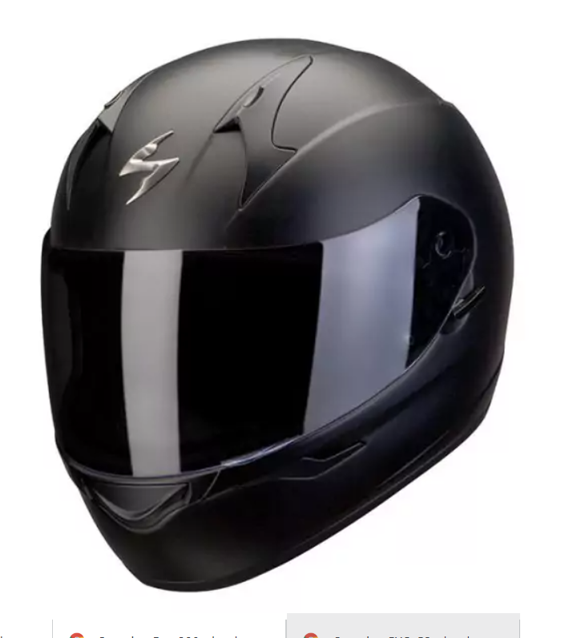

# id-al-parapluie

**bonou**

# bonjour 1

## bonour 2

### bonjour 3

- liste 1
- liste 2

---

[ici](https://www.youtube.com/watch?v=7Ab5DIWYUMw)

_italique_



```
ligne code
<h1>Site dr idriss</h1>

    <hr/>


    <p>Bonjour comment ca va bien </p>


    
```
